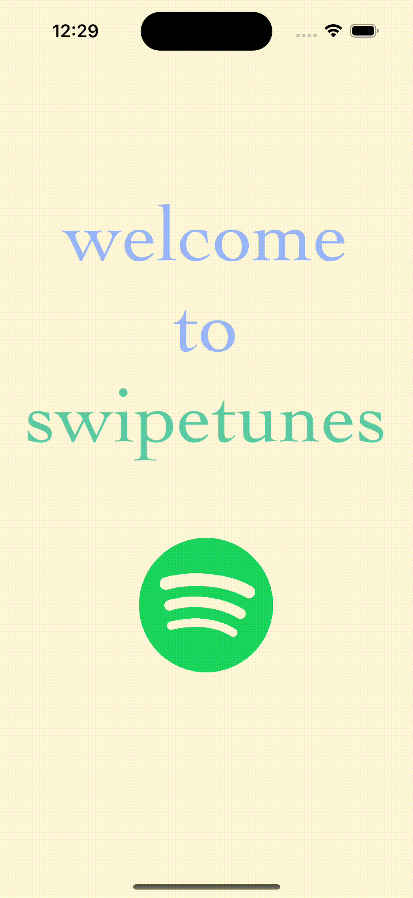

# Milestone 1 - Swipetunes (iOS)

## Table of Contents

1. [Overview](#Overview)
1. [Product Spec](#Product-Spec)
1. [Wireframes](#Wireframes)
2. [Progress](#Progress)

## Overview

### Description

Swipetunes is a dynamic music discovery app that lets you find your perfect match in songs. Mimicking the feel of modern dating apps, users can swipe their way to create the perfect playlist for any occasion.

### App Evaluation

- **Category:** Music (Entertainment)
- **Mobile:**  The app's unique mobile experience is evident through its integration with mobile-specific features such as swiping gestures for song selection, allowing users to easily swipe right on songs they like or left on songs they don't, mimicking the familiar swiping experience of popular dating apps. The app also utilizes audio capabilities to allow users to preview and listen to songs directly from their mobile devices, enhancing the convenience and mobility of the music discovery process.
- **Story:** The app's story revolves around providing users with a fun and engaging music discovery experience that emphasizes the excitement of exploring and discovering new music. It allows users to curate their own personalized playlists and create a unique soundtrack to their lives.
- **Market:**  The market for this app is potentially large, as it appeals to music lovers of all kinds who are looking for a unique and interactive way to discover new songs and curate personalized playlists. The app could also cater to niche groups of people who have specific music preferences or interests, such as fans of particular genres, moods, or occasions. The app's potential user base could range from casual listeners to avid music enthusiasts, offering a wide market scope.
- **Habit:**  The app has the potential to be habit-forming as it encourages users to frequently open and use the app to discover new music and curate their playlists. Depending on the user's level of engagement with music, the app could become a daily or regular habit, as users swipe through songs and add them to their playlists. The addictive and engaging nature of the app's swiping interface and personalized music curation could lead to habitual usage and increased user retention.
- **Scope:**  The scope of this app is well-defined, with a focus on creating a simple and intuitive music discovery experience that mimics the swiping interface of dating apps. The app's core features include integration with Spotify's user authentication for playlist access, and playlist curation. While there may be technical challenges in integrating with the Spotify API, SDK and implementing smooth swiping functionality, the overall scope of the app is manageable within the project timeline.

## Product Spec

### 1. User Features (Required and Optional)

**Required Features**

* User can login via Spotify
* User can logout
* User can add to new or existing playlist
* User can get recommendations based on user's top tracks
* User can listen to a snippit of each song recommended
* User can swipe right to add song to playlist
* User can swipe left to dismiss the song
* User can see a log of their recently swiped songs

**Stretch Features**

* User can get recommendations based on tracks, artists, or genres
* User can select between two different songs
* User can share songs on different platforms

### 2. Screen Archetypes

- Login Screen

  - User can login via Spotify 

 Sprint 1
- [x] Login UI
- [ ] Spotify API connection
- [ ] Swipe to Login

- Discover

Sprint 2  
- [ ] User can listen to a snippit of each song recommended  
- [ ] User can get recommendations based on user's top tracks
 
Sprint 3
- [ ] User can swipe right to add song to playlist  
- [ ] User can swipe left to dismiss the song

Sprint 5
- [ ] User can add to new or existing playlist

- Log

Sprint 4  
- [ ] User can see a log of their recently swiped songs  
- [ ] User can logout

### 3. Navigation

**Tab Navigation** (Tab to Screen)

* Discover
* Log

**Flow Navigation** (Screen to Screen)

- Login Screen
  - => Discover
- Discover
  - => Login Screen
- Log
  - => Login Screen
 

## Wireframes

## Progress

Reflection: More work needed. Will adjust goals accordingly. API might take time to implement with authorization. Recalibrated. 

- I have read API documentation and identified UIKit components needed
- I have designed logos and UIs
- I have started interactive login screen
  
  
